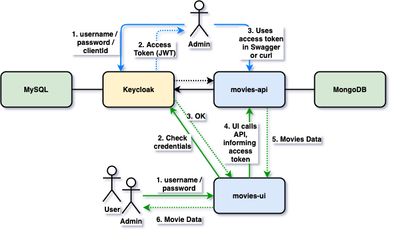

# springboot-react-keycloak

The goal of this project is to secure `module7` using [`Keycloak`](https://www.keycloak.org/)(with PKCE). `module7` consists of two applications: one is a [Spring Boot](https://docs.spring.io/spring-boot/docs/current/reference/htmlsingle/) Rest API called `movie_api` and another is a [ReactJS](https://reactjs.org/) application called `movie_ui`.

## Project diagram



## Applications

- ### movie_api

  `Spring Boot` Web Java backend application that exposes a REST API to manage **movies**. Its secured endpoints can just be accessed if an access token (JWT) issued by `Keycloak` is provided.

  `movie_api` stores its data in a embedded [`Mongo`](https://www.mongodb.com/) database.

  `movie_api` has the following endpoints

  | Endpoint                                                          | Secured | Roles                       |
  |-------------------------------------------------------------------|---------|-----------------------------|
  | `GET /api/userextras/me`                                          | Yes     | `MOVIES_MANAGER` and `USER` |
  | `POST /api/userextras/me -d {avatar}`                             | Yes     | `MOVIES_MANAGER` and `USER` | 
  | `GET /api/movies`                                                 | No      |                             |
  | `GET /api/movies/{imdbId}`                                        | No      |                             |
  | `POST /api/movies -d {"imdb","title","director","year","poster"}` | Yes     | `MOVIES_MANAGER`            |
  | `DELETE /api/movies/{imdbId}`                                     | Yes     | `MANAGE_MOVIES`             |
  | `POST /api/movies/{imdbId}/comments -d {"text"}`                  | Yes     | `MOVIES_MANAGER` and `USER` |

- ### movies-ui

  `ReactJS` frontend application where `users` can see and comment movies and `admins` can manage movies. In order to access the application, `user` / `admin` must login using his/her username and password. Those credentials are handled by `Keycloak`. All the requests coming from `movies-ui` to secured endpoints in `movies-api` have a access token (JWT) that is generated when `user` / `admin` logs in.

  `movies-ui` uses [`Semantic UI React`](https://react.semantic-ui.com/) as CSS-styled framework.

## Prerequisites

- [`Java 11+`](https://www.oracle.com/java/technologies/downloads/#java11)
- [`npm`](https://docs.npmjs.com/downloading-and-installing-node-js-and-npm)
- [`jq`](https://stedolan.github.io/jq)
- [`OMDb API`](https://www.omdbapi.com/) KEY

  To use the `Wizard` option to search and add a movie, you need to get an API KEY from OMDb API. In order to do it, access https://www.omdbapi.com/apikey.aspx and follow the steps provided by the website.

  Once you have the API KEY, create a file called `.env.local` in `springboot-react-keycloak/movies-ui` folder with the following content
  ```
  REACT_APP_OMDB_API_KEY=<your-api-key>
  ```

## PKCE

As `Keycloak` supports [`PKCE`](https://tools.ietf.org/html/rfc7636) (`Proof Key for Code Exchange`) since version `7.0.0`, we are using it in this project.

## Running module7 using Maven & Npm

- **movies-api**

    - Open a terminal and navigate to `module_7/mod7_movie_api` folder

    - Run the following `Maven` command to start the application
      ```
      ./mvnw clean spring-boot:run -Dspring-boot.run.jvmArguments="-Dserver.port=8080"
      ```

      Once the startup finishes, `KeycloakInitializerRunner.java` class will run and initialize `company-services` realm in `Keycloak`. Basically, it will create:
        - Realm: `company-services`
        - Client: `movies-app`
        - Client Roles: `MOVIES_MANAGER` and `USER`
        - Two users
            - `admin`: with roles `MANAGE_MOVIES` and `USER`
            - `user`: only with role `USER`

    - **Social Identity Providers** like `Google`, `Facebook`, `Twitter`, `GitHub`, etc can be configured by following the steps described in [`Keycloak` Documentation](https://www.keycloak.org/docs/latest/server_admin/#social-identity-providers)

- **movies-ui**

    - Open another terminal and navigate to `springboot-react-keycloak/movies-ui` folder

    - Run the command below if you are running the application for the first time
      ```
      npm install
      ```

    - Run the `npm` command below to start the application
      ```
      npm start
      ```

## Applications URLs

| Application | URL                                         | Credentials                           |
|-------------|---------------------------------------------|---------------------------------------|
| movie-api   | http://localhost:8080/swagger-ui/index.html | [Access Token](#getting-access-token) |
| movie-ui    | http://localhost:3000                       |                                       |
| Keycloak    | http://localhost:8080/admin                 |                                       |


## Testing movies-api endpoints

You can manage movies by accessing directly `movie_api` endpoints using the Swagger website or `curl`. However, for the secured endpoints like `POST /api/movies`, `PUT /api/movies/{id}`, `DELETE /api/movies/{id}`, etc, you need to inform an access token issued by `Keycloak`.

### Getting Access Token

- Open a terminal

- Run the following commands to get the access token
  ```
  ACCESS_TOKEN="$(curl -s -X POST \
    "http://localhost:8080/realms/company-services/protocol/openid-connect/token" \
    -H "Content-Type: application/x-www-form-urlencoded" \
    -d "username=admin" \
    -d "password=admin" \
    -d "grant_type=password" \
    -d "client_id=movies-app" | jq -r .access_token)"

  echo $ACCESS_TOKEN
  ```

### Calling movies-api endpoints using curl

- Trying to add a movie without access token
  ```
  curl -i -X POST "http://localhost:9080/api/movies" \
    -H "Content-Type: application/json" \
    -d '{ "imdbId": "tt5580036", "title": "I, Tonya", "director": "Craig Gillespie", "year": 2017, "poster": "https://m.media-amazon.com/images/M/MV5BMjI5MDY1NjYzMl5BMl5BanBnXkFtZTgwNjIzNDAxNDM@._V1_SX300.jpg"}'
  ```

  It should return
  ```
  HTTP/1.1 401
  ```

- Trying again to add a movie, now with access token (obtained at #getting-access-token)
  ```
  curl -i -X POST "http://localhost:9080/api/movies" \
    -H "Authorization: Bearer $ACCESS_TOKEN" \
    -H "Content-Type: application/json" \
    -d '{ "imdbId": "tt5580036", "title": "I, Tonya", "director": "Craig Gillespie", "year": 2017, "poster": "https://m.media-amazon.com/images/M/MV5BMjI5MDY1NjYzMl5BMl5BanBnXkFtZTgwNjIzNDAxNDM@._V1_SX300.jpg"}'
  ```

  It should return
  ```
  HTTP/1.1 201
  {
    "imdbId": "tt5580036",
    "title": "I, Tonya",
    "director": "Craig Gillespie",
    "year": "2017",
    "poster": "https://m.media-amazon.com/images/M/MV5BMjI5MDY1NjYzMl5BMl5BanBnXkFtZTgwNjIzNDAxNDM@._V1_SX300.jpg"
  }
  ```

- Getting the list of movies. This endpoint does not requires access token
  ```
  curl -i http://localhost:9080/api/movies
  ```

  It should return
  ```
  HTTP/1.1 200
  [
    {
      "imdbId": "tt5580036",
      "title": "I, Tonya",
      "director": "Craig Gillespie",
      "year": "2017",
      "poster": "https://m.media-amazon.com/images/M/MV5BMjI5MDY1NjYzMl5BMl5BanBnXkFtZTgwNjIzNDAxNDM@._V1_SX300.jpg",
      "comments": []
    }
  ]
  ```

### Calling movies-api endpoints using Swagger

- Access `movie_api` Swagger website, http://localhost:8080/swagger-ui/index.html

- Click `Authorize` button.

- In the form that opens, paste the `access token` (obtained at [getting-access-token](#getting-access-token)) in the `Value` field. Then, click `Authorize` and `Close` to finalize.

- Done! You can now access the secured endpoints
